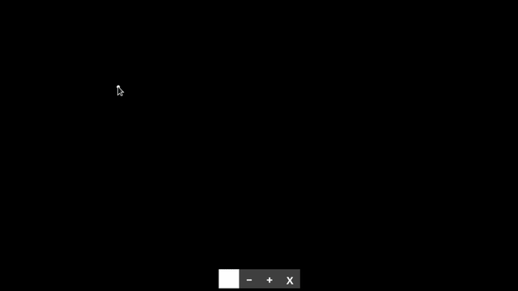

# lavagna

> It's a blackboard, not a lasagna.



*Lavagna* is a "no frills", collaborative, blackboard, ideal for simple
sketches during online meetings. You have just a black screen, without icons or
buttons cluttering your beautiful drawings.

Just you, your peers, and your chalk.

## Keyboard bindings

| Button | Action   | Note                                 |
|--------|----------|--------------------------------------|
| C      | Color    | Change the chalk color               |
| M      | Grow     | Grow chalk size 2x                   |
| N      | Shrink   | Shrink chalk size 2x                 |

## Installation

[Archives of precompiled binaries for *lavagna* are available for Windows, macOS
and Linux.](https://github.com/alepez/lavagna/releases/latest)

### Install from source

If you're a **Rust programmer**, *lavagna* can be installed with `cargo`.

- Note that the minimum supported version of Rust for *lavagna* is 1.61.0,
  although *lavagna* may work with older versions.

To install from sources:

```shell
git clone https://github.com/alepez/lavagna.git
cd lavagna
cargo install --path lavagna --locked
```

### Install from crates.io

To install from [crates.io](https://crates.io):

```shell
cargo install lavagna
```

Note that the version available in *crates.io* may be older than the one you
find on [latest release
page](https://github.com/alepez/lavagna/releases/latest).

## Instant collaboration

*lavagna* can use *WebRtc* for instant collaboration. Try it:

```shell
lavagna --collab-url ws://example.com/YOUR_ROOM
cargo run --package lavagna -- --collab-url ws://example.com/YOUR_ROOM
```

Change `YOUR_ROOM` to whatever you prefer. If you do the same from a different
computer, whatever you draw is visible on the other side (and vice versa).

You can setup your own server by using
[lavagna_server crate](https://github.com/alepez/lavagna_server) or [docker
image](https://hub.docker.com/r/alepez/lavagna_server)

## Desktop app development

`lavagna` works on many operating systems:

- Linux (x86)
- Linux (ARM)
- macOS (x86)
- Windows

You just need to have a Rust toolchain installed. Run this from the project
directory:

```shell
cargo run
```

To print help information, just use:

```shell
cargo run -- --help
```

## Android app development

Android development and testing is easy, thanks to [cargo-apk](https://crates.io/crates/cargo-apk)

You just need to install `cargo-apk`:

```shell
cargo install cargo-apk
```

Plug your phone (or a virtual device) and launch lavagna:

```shell
cargo apk run --package lavagna_android
```
